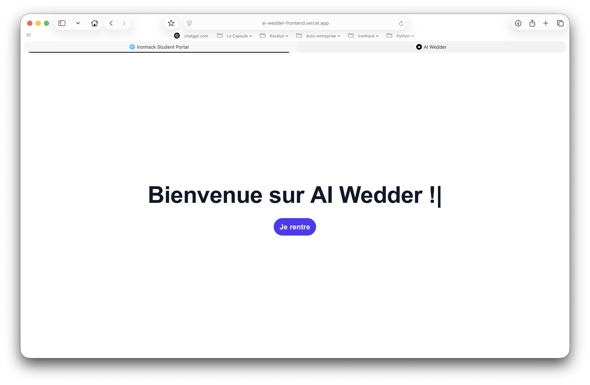
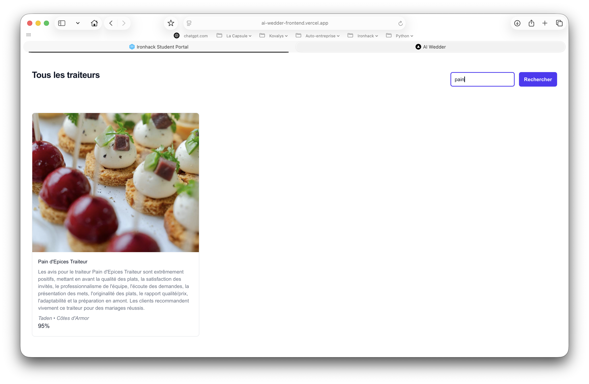

# AI-Wedder Microservice

This repository hosts a FastAPI-based microservice that processes customer reviews for wedding caterers in France. It combines classification, clustering, and summarization powered by Hugging Face models and the OpenAI GPT API.

---

## 📖 Preview






---

## ✨ Key Features

### 1. **Sentiment Classification**

- Uses a custom fine-tuned `CamemBERT` model for classifying reviews as:

  - Positive
  - Neutral
  - Negative

- Hosted on Hugging Face: `Jyokim/camembert-wedder-nps-classifier`

### 2. **Zero-Shot Clustering**

- Uses `distilcamembert-base-nli` for zero-shot classification.
- Categories are generated dynamically by GPT based on sampled reviews.
- Each review is then assigned scores for each thematic label.

### 3. **Review Summarization & Scoring**

- Reviews are grouped per caterer.
- GPT is prompted to:

  - Summarize all reviews.
  - Extract key points (e.g. strengths, weaknesses).
  - Assign a subjective score (0–100%).

- The final results are stored in MongoDB (`venues` collection):

  - `aiSummary`
  - `aiKeyPoints`
  - `aiGlobalScore`

### 4. **Streaming Endpoint**

- `/summarize`: Streams status messages and progress while processing.
- Allows near real-time monitoring of the sentiment + summary workflow.

---

## Run Locally

Clone the project

```bash
git clone https://github.com/Jyok1m/ai-wedder-microservice.git
```

Go to the project directory

```bash
cd ai-wedder-microservice
```

Create virtual environnement

```bash
conda env create -f environment.yml
```

Activate virtual environnement

```bash
conda activate ai-wedder
```

Start the server

```bash
uvicorn app.main:app --host 0.0.0.0 --port 8081 --reload
# or
make run
```

Make the request

```bash
curl -X POST http://localhost:8081/reviews/summarize
```

---

## 📂 Folder Structure

```
.
├── app/
│   ├── main.py
│   ├── routes/
│   └── db/
│       └── mongo.py
├── utils/
│   └── [...]
├── requirements.txt
├── Dockerfile
└── README.md
```

---

## 🚸‍♂️ API Endpoint

### `POST reviews/summarize`

Triggers the following steps:

1. Retrieve reviews from MongoDB.
2. Ask GPT to suggest clustering labels.
3. Classify each review (sentiment + clustering).
4. Store enriched reviews.
5. Aggregate summaries and key points per caterer.
6. Store final results.

**StreamingResponse** is used to stream logs back to the client.

---

## 🛋️ Scraper Module (Playwright)

A separate Node.js script is available to **scrape wedding caterers** from [mariages.net](https://www.mariages.net).

This tool is **not part of the Python FastAPI app**, but can be triggered independently via :

### `POST https://ai-wedder-backend.vercel.app/scraper/mariages-net`

Triggers the following steps:

1. Navigates across regions: Ille-et-Vilaine, Côtes d'Armor, Basse-Normandie.
2. Extracts:

- Caterer name
- Location
- Picture
- Rating and number of reviews
- Individual reviews (author, title, score, aspects)

3. Performs automated scrolling to capture all content.
4. Stores reviews and catering companies to a MongoDB Database.

---

## 🫹 Technologies Used

| Tool         | Purpose                            |
| ------------ | ---------------------------------- |
| FastAPI      | API framework                      |
| MongoDB      | Data persistence                   |
| ExpressJS    | API scraper                        |
| NextJS       | Frontend                           |
| Vercel       | Preview deployments                |
| Hugging Face | Text classification & clustering   |
| OpenAI GPT   | Summarization + prompt generation  |
| Playwright   | Scraping reviews (external module) |
| TQDM         | CLI progress display               |

---

## 👁‍🗨 Demo Preview

- [Deployed Frontend](https://ai-wedder-frontend.vercel.app)
- [Deployed Backend](https://ai-wedder-backend.vercel.app)

---

## 👁 Repositories

- [Frontend](https://github.com/Jyok1m/ai-wedder-frontend)
- [Backend](https://github.com/Jyok1m/ai-wedder-backend)
- [Microservice](https://github.com/Jyok1m/ai-wedder-microservice)

---

## 🚀 Next Steps

- Deploy to cloud via Render/Northflank
- Add user-facing dashboard to view summaries
- Enable full review analytics with charting

---

## ✉️ Author

**Joachim Jasmin** - [@jyok1m](https://github.com/jyok1m)

---

## ⚖️ License

MIT License
